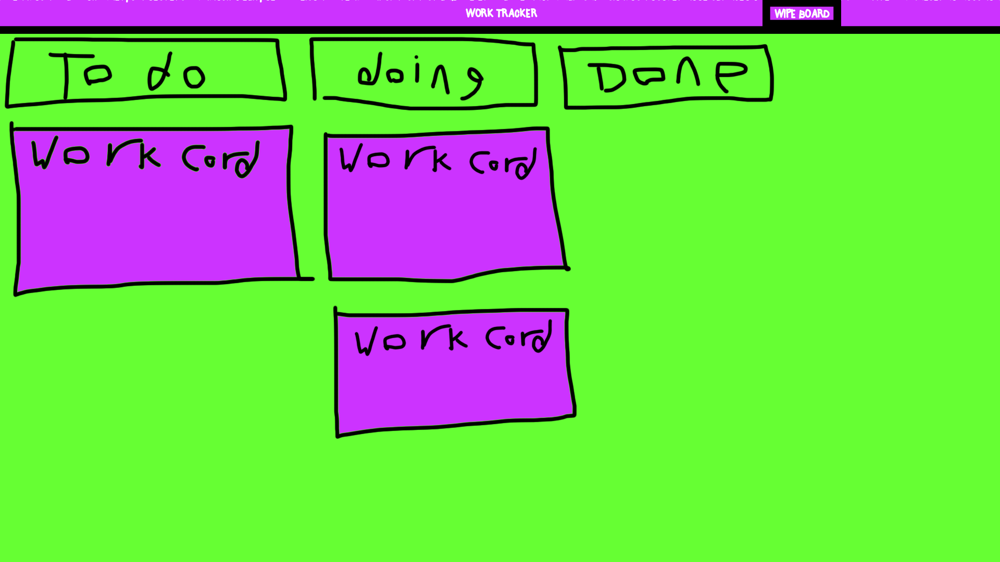

# Work Tracker
-------
## Project aim
The objective of this project is to create a fun way to track work via a collection of work cards. (Doesnt that sound *fun?*) Each work card is the equivalent of a post it note but represented digitally. The project will be using the `React` library but will also develop my `HTML`, `CSS` and `Javascript` skills.

## Features
* **Board** - This is where the cards live. 
    - Title of the board
    - Title of the stage
    - Ability to modify colour of the board
    - Card slider 
    - Delete card 
    - Add new card 
    - Clear board button
    - Work complete end stage
    - Completed works page
    - Confetti & hooray when task is completed
* **Task cards** - These display the current task you are on.  
    - Title of the card
    - Description of the work involved
    - Add doodle to card
    - Ability to modify colour of the card
* **Optional features** - Any other features that arent crucial.
    - Chat feature bottom right
    - Add name function
    - Add message function
    - Show time message sent function 
    -------
    
## (Very) rough sketch

